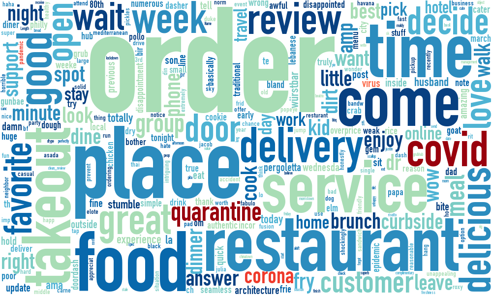

# Restaurant Response to COVID-19
The goal of this analysis is to examine sentiment surrounding restaurants following the impacts of the coronavirus outbreak in March, 2020. Across the U.S., restaurants have been forced to rapidly change their business strategies from dine-in to carry-out.

To gather data for this analysis, I scrape Yelp reviews for 200 restaurants in each of the 25 cities most impacted by COVID-19 (which I define as highest # of deaths instead of highest # of cases due to testing limitations, although this still is likely not the best way to measure this).

***
1. [Yelp Scraping](#Yelp-Scraping)  
    1a. [Identify COVID-19-Affected Counties](#Identify-COVID-19-Affected-Counties)  
    1b. [Identify Restaurants](#Identify-Restaurants)  
    1c. [Scrape Reviews](#Scrape-Reviews)  
2. [Restaurant Sentiment Analysis Around COVID-19](#Restaurant-Sentiment-Analysis-Around-COVID-19)  
    2a. [Data Cleaning](#Data-Cleaning)  
    2b. [Sentiment Analysis](#Sentiment-Analysis)  
    2c. [Modeling of Reviews](#Modeling-of-Reviews)  

***
## [Yelp Scraping](yelp-scraping.ipynb)
The notebook for scraping Yelp can be found [here](yelp-scraping.ipynb). 

### Identify COVID-19-Affected Counties
First, I determined which cities were most impacted by COVID-19 using [data provided by the New York Times, available here](https://raw.githubusercontent.com/nytimes/covid-19-data/master/us-counties.csv). This .csv is updated ~1x/day and contains number of COVID-19 cases and deaths by US county by day.

### Identify Restaurants
Using Yelp's API, I generated a list of up to 200 restaurants for each of the 25 counties. The restaurants are largely clustered around the center of each county (you can see this in the [restaurant_distribution.html](plotly_figures.zip) plot) since they are pulled using just the county name. Each business has a unique ID that can be used to scrape individual reviews from the webpage. Of note, Yelp's API does allow you to access reviews, but only 3 per restaurant, and not the most recent 3: they are sorted using Yelp's sorting algorithm.

### Scrape Reviews
Using the business IDs I gathered using the API, I used BeautifulSoup to scrape up to 100 reviews per restaurant for each restaurant. This process was long and required attention throughout: Yelp's site detects the scraping and asks if you're a robot, at which point, the scraping stops. I kept a second Yelp window open and refreshed every 90 seconds; if I saw a message asking for verification, I stopped the scraping, verified my identity, and resumed. I looped back over the business IDs to re-scrape businesses that were missed several times. The scraping program takes approximately 1 hour per 200 businesses.

## [Restaurant Sentiment Analysis Around COVID-19](covid19-sentiment-analysis.ipynb)
The notebook for the sentiment analysis can be found [here](covid19-sentiment-analysis.ipynb); I also uploaded an HTML version [here](covid19-sentiment-analysis.html), as the notebook contains hyperlinking throughout.

### Data Cleaning 
To prepare the review data for analysis, I used the spaCy library for text lemmatization and cleaning. Of note, there are two sepearate cleaning phases in this analysis, as VADER uses punctuation and capitalization to capture emphasis (see below). In the second cleaning stage, I lowercased all words and removed punctuation.

### Sentiment Analysis
To complete my sentment analysis, I used [NTLK's VADER toolkit](https://github.com/cjhutto/vaderSentiment). VADER generates a positive, negative, and neutral score for each review and then combines them into a compound score ranging from -1 to 1. Throughout my analysis, I've examined the positive, negative, and compound scores, mainly to determine if shifts in compound scores are due to an increase in positive, negative, or neutral (if neither positive nor neutral) sentiment. Because Yelp reviews also include a 1- to 5-star rating, I also explored sentiment using review stars and the relationship between Yelp review stars and VADER scores to verify that the VADER scores appropriately correlated with self-assigned reviewer sentiment.

I broke the sentiment analysis down into pre- and post-lockdown using reviews left after March 15, 2020 as a cutoff date and examined differences between the two groups. Using bootstrap testing, I found a significant negative shift in the sentiment of post-lockdown reviews. I further examined sentiment by region and found that not all regions experienced a negative shift; however, New York City did experience this shift (a mean difference of -.10 points), in addition to other major cities including LA, New Orleans, Philadelphia, and Chicago.

### Modeling of Reviews
Next, I generated a TF-IDF model from the reviews to extract the relative importance of various terms and used that to model the data using KMeans clustering. I determined that the discrete number of clusters was not clear, but there was a slight plateau at ~13 clusters. I used PCA to visualize the clusters in 2 dimensions. 

Finally, I searched the clusters for the maximum TI-IDF values for coronavirus-like terms (i.e., "covid", "coronavirus", "corona", "covid-19", "virus", "pandemic", and "quarantine") and found they all grouped together, along with terms like "order", "time", "delivery", "support", "takeout", "service", and even "online". I revisited the sentiment analysis and determined that the sentiment of reviews within this cluster was significantly lower than the sentiment of the whole group and of other clusters, which might explain the decrease in overall sentiment after March 15, 2020 and indicates decreased sentiment in reviews addressing COVID-19. 

An example of text from a negative review in this cluster:
>"I am an essential worker on the frontlines fighting corona so before you say it's hard on everyone blah blah I am there and way deeper into this than sitting in. Restaurant making mistakes that CAN and SHOULD be avoided to protect lives. This is not joke, not a game and these things can not happen while hundreds are losing their lives a day in this area, fix it or close down until after this is over so you can go back to screwing up orders, not now."  
&mdash;The Cheesecake Factory in Passaic, New Jersey

Of note, many of the positive reviews in this cluster also mention health-related practices, for example:
>"The delivery was prompt. The transaction of payment and tip were done in advance.  The driver had a mask and gloves in when they dropped the food off at our door.  The driver phoned me when he arrived.  It was safe and easy and I appreciated their attention to our CDC Guidelines."  
&mdash;Cumin N Eat in Passaic, New Jersey1

## Conclusions and Future Directions
Overall, there is a siginificant decrease in sentiment in recent months, and reviews associated with COVID-19-like terms have significantly worse sentiment than reviews not associated with the pandemic or prior to the outbreak in the U.S. New York City, the center of the outbreak in the U.S., notably had a significant decrease overall after lockdown to further support the conclusion that COVID-19 has negatively impacted public sentiment towards restaurants, despite carry-out options.

Future directions include rescraping Yelp for more recent data - the current dataset was scraped in mid-April and does not span more recent weeks. Additionally, I encountered computational limitations to running the KMeans clustering on all available reviews, so using cloud-based resources would be a good next step to include all available data.

More minor future additions include exploring different numbers of clusters for the KMeans - normally, cluster number can be determined by observing an elbow at a certain cluster number; however, I didn't observe that here and had to somewhat arbitrarily choose 13 clusters. Additionally, specifically removing restaurant "stop words", such as "place" and "good" could provide more insight into specific clusters. These terms are really common (see the word clouds) and could make it more difficult to see top meaningful terms in each cluster. Finally, I think it would be interesting to explore trends in neutral reviews. Throughout this analysis, I look mostly at compound, positive, and negative sentiment, but not neutral sentiment, which could provide more insight into sentiment here. 

The methodology in this analysis is broadly applicable to identifying trends in sentiment in text data and not limited to restaurant data or coronavirus-related analyses: for example, a very similar analysis could be used to identify painpoints by region in restaurant reviews or even by restaurant or cuisine type.
***
_Note: plotly figures do not seem to be rendering consistently using the github viewer for Jupyter Notebooks, even if you use nbviewer or view the html conversion of the notebook. I've uploaded htmls of the plotly figures [into a seperate folder](plotly_figures.zip) and compressed it - you can download that folder to view the interactive figures if you aren't downloading and running the notebook._ 

***
\[1] It's just a coincidence both reviews are from the same county. I've included a plot in the notebook to show that the reviews for that cluster come from a representative distribution of counties, most of which are actually from L.A. (~17% of reviews).

